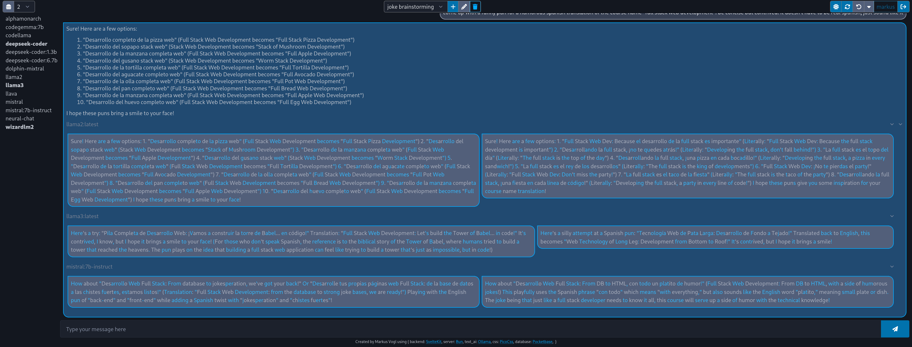
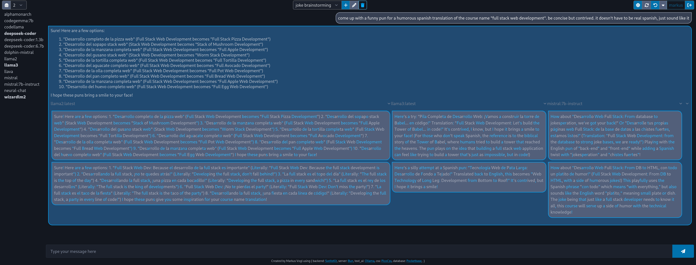
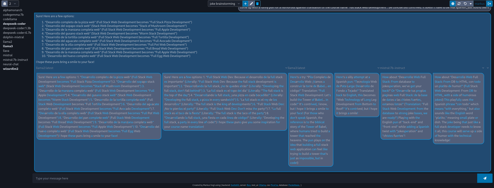
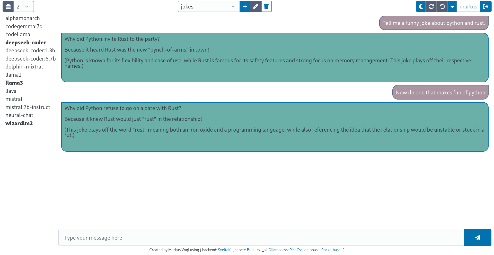

# Full-stack-bun-pocketbase-svelte

## Requirements

This project runs with node.js or bun as a server. You can replace any "bun" statement with "node" in the following.

To install, you just run `bun i`, to start the pocketbase server, run `bun run pocketbase` and to run the main app, run `bun run dev`.

To build the app, run `bun run build`, to run the production preview server, run `bun run preview`.

## External dependencies

The app expects you to have a pocketbase server running (linux binary in the /pb/ directory) at its default port 8090 and an ollama server at its default port 11434.

If they run at any other port or not localhost, change the vite.config.ts. This also by default exposes the pocketbase admin ui at `/_/`. This app runs at port 1337 on http.

You should also have some models in ollama installed, i.e. llama2, llama3, gemma... you can do this with `ollama pull llamaa3`.

The app will automatically reverse-proxy via vite to the pocketbase server and the ollama server, so you only have to expose the vite port.

## What can it do?

- User management via pocketbase (login with google/github... optional)
- Query your favourite LLMs via ollama
- Manage your chats and messages via pocketbase (create, list, delete, update name)
- Support for multi-model querying and multi-time querying. Pop the accordion to see the results.
- Switch models mid conversation
- Innovative double-enter to send message

## Cool packages used and what they do

- Modern icon design via `@fortawesome/free-solid-svg-icons` and `svelte-fa`
- Slim css and dark mode and possibly theming via `@picocss/pico`
- Ollama and pocketbase api clients via `ollama` and `pocketbase` - they even do streaming!
- Formatted llm output via `svelte-markdown`
- Permanent db storage via `pocketbase` and local storage via ` svelte-persisted-store`
- Auto-resizing textarea via `svelte-autosize`. Plain html/css can't do that appearently.
- Autoscrolling chats to the bottom - that's not a css/html feature

## More

* **Author**: Markus V.

* **Señor lecturer**: Markus W. y ChatGPT4

* **Lecture de señor**: Full stack web development @ JKU Linz

* **License**: Create commons Zero v1.0 Universal. You can do whatever you want with this code. It's yours now. Enjoy!

* **Inspiration**: Ollama WebUI aka (Open WebUI)[https://github.com/open-webui/open-webui]

## Demo

The app has multiple layouts to display the multi-chat feature, in addition to a compact mode.

Here is the bright mode for insane people

<video source="demo/demo.mkv" controls></video>